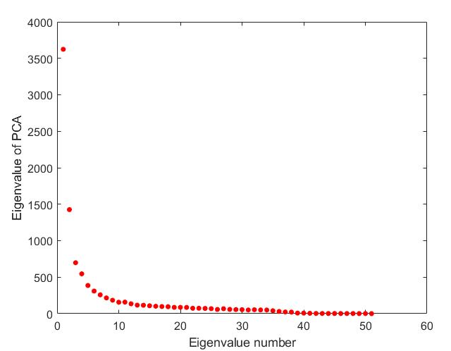
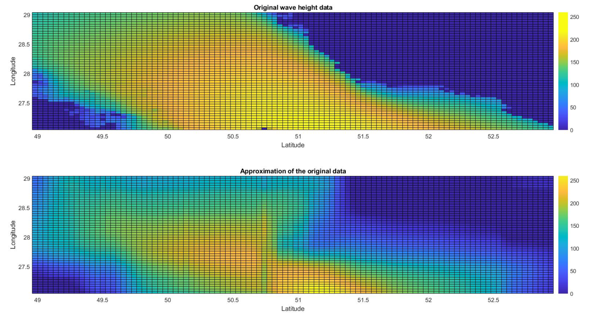

# Principal Component Analysis (PCA) 

 
PCA is one of the main machine learning techniques in dimensionality reduction and sparse representation. This method finds the principal components (scores) of the system. Principal components are the orthogonal bases containing the most variation in the study system. This means that if the data is projected to the principal components as the new bases, the main information of the data can be distinguished from the less essential one. This has various applications such as noise detection and dimensionality reduction. The importance of the orthogonal bases are not the same and each has its own intensity. The bases are eigenvectors, and the intensities are eigenvalues which are estimated via Singular Value Decomposition (SVD). PCA is a SVD  type method and the matrix decomposition of SVD is the central part of PCA and is the main challenge to code. 

First, it is required to define the input data into a matrix form $X$. Matrix $X$ is a two dimensional description of the study system that for example could be an image, a dynamical system or any other case study. The $X$ matrix is decomposed into three matrixes by applying SVD: 

 $$X = U \Sigma V^T $$ 

where $U$ is the matrix of eigenvectors, i.e. each column of $U$ contains one of the eigenvectors($u_i$) and $\Sigma$ is a diagonal matrix including eigenvalues $\lambda_i$. By definition, any eigenvalue and its corresponding eigenvector have to satisfy the following equation: 
$$Xu_i= \lambda_i u_i$$  
However, in practice, it is entirely inefficient to compute the eigenvalues and eigenvectors by this equation. This is due to the requirement of finding the determinant of the matrix in this approach which is very complicated for large data sets. Therefore, usually, the QR factorization method is employed to do matrix decomposition of SVD. 

QR factorization decomposes the $X$ matrix into $Q$ and $R$ matrixes which $Q$ contains the orthonormal bases and $R$ is an upper triangle matrix. There are different algorithms to solve QR factorization, and the most common one is the Gram Schmidt process. In the Gram Schmidt process, the first column of $X$ is considered as the first orthogonal basis and the second column is projected in a way that the projection becomes orthogonal to the first column and this is considered as the second orthogonal basis vector. Now, from the third column of $X$, a projection that is orthogonal to both the first and second orthogonal bases can be found. This process is continued to the last column of $X$ to find all the orthogonal vectors which together build the orthogonal matrix. By normalizing each column of the created matrix, the $Q$ orthonormal matrix is extracted from $X$ and by knowing $X$ and $Q$, the $R$ matrix is computed.

$$X = QR $$ 

Worthwhile mentioning that $Q$ and $R$ are unitary matrixes and their inverses are equal to their transposes. Here, the computed $R$ is an upper triangle matrix.

## Building SVD from QR
The QR factorization is required to pass through an iterative process to build up SVD. By computing $x_i = RQ$ at each $i$ iteration, the new $x_i$ is passed through the QR factorization process to provide the $x_i$ for the next step iteration. This is continued until convergence and at this point, the obtained $R$ is diagonal and therefore is equal to the $\Sigma$ matrix of SVD. Similarly, the obtained $Q$ after convergence is equal to the $U$ matrix of SVD. An essential point to be mentioned here is that this iterative process can only be employed for square $X$ matrix. By the fact that the eigenvalue matrix $U$ of $X$ is equal to the eigenvalue matrix of $XX^T$, the $XX^T$ matrix is passed through the QR factorization and the iterative process to find $U$. Similarly, $V$ is the eigenvalue matrix of $X^TX$. Therefore using square matrixes $XX^T$ and $X^TX$, the decomposed $U$, $\Sigma$ and $V$ matrixes of SVD related to any $X$ matrix can be extracted by following this process. 

## Building PCA from SVD
PCA is a type of SVD with a more statistical approach. In PCA, first the mean of each feature vector (columns of $X$) is subtracted from it and then SVD is applied on the mean subtracted version of $X$. Here, the multiplication of the obtained $U$ with obtained $\Sigma$ provides the matrix of the principal components and the obtained $V$ is called matrix of loadings.

## The C++ code: 
1) `data_processing` is a `class` to import data, validate it and finally provides a suitable matrix of data to be used as the input in other classes. In this code, matrixes of numbers are defined in the form of `vector<vector<double>>`. The `class` can check the existence of the input file, read from it in `string` type, check whether the `string` values are valid numbers and when all these steps are passed, it can change the type of the data to `double` and make the desired matrix of data for other classes. In addition, this `class` has a member function (`lat_long`) which is specifically designed for spatial oceanic, atmospheric and hydrological input data. The inputs of this function are the latitude and longitude values of the first element in the data matrix, as well as latitude and longitude step sizes. If the input data is a type of spatial oceanic, atmospheric or hydrological one, this function can build the grid of longitude and grid of latitude values. it is of paramount importance in many cases to include the latitude and longitude information in the study. These grids are used here to plot the input data and output results.
2) `matrix` is a `class` which contains all the required matrix operations for these algorithms such as defining a matrix with desired dimension, matrix transpose and matrix multiplication. 
3) `qr_factor` is a `class` for computing QR factorization. It is based on the Gram Schmidt process as explained earlier and it provides the unitary matrix $Q$ and upper triangle matrix $R$.
4) `svd` is a `class` defined to find $U$, $\Sigma$ and $V$ based on the above mentioned iterative process. Since SVD can be considered as a type of QR method, I used class inheritance here and the `qr_factor` is a base for the `svd`. In addition, an object of the `matrix` `class` is called in `svd` to do the required matrix operations.    
5) `pca` is a `class` defined to obtain matrix of principal components, matrix of eigenvectors, matrix of eigenvalues and matrix of loadings. Since PCA is a type of SVD, here, `svd` is considered as a base `class` for `pca` and the inherited member functions of the `svd` provide the decomposed unitary matrixes as the final step in the principal component analysis.

## DATA: 
The code is general and applicable to any type of case study and data in which dimensionality reduction and sparse representation matter. The only requirement is to provide the $X$ matrix as the input of the whole process and classes. 
In this study, water wave height data from a part of Persian Gulf is used as the input. This is a spatial dataset related to a specific time. 

## Result:
We can approximate the $X$ input matrix using PCA and SVD. As already mentioned, PCA and SVD project the data to the orthonormal bases which results in extracting the essential information in the dataset. The best way to describe this is by visually demonstrating the eigenvalues. The $\Sigma$ matrix is diagonal and its diagonal values are the eigenvalues which are ordered from the highest to lowest one. The first eigenvalue $\lambda_1$ corresponds to the first column of $U$ matrix ($u_1$) which is the first eigenvector. Since $\lambda_1$ is the highest eigenvalue, $u_1$ is the most important eigenvector and contains the most essential information in the system. Similarly, $u_2$ is the second most important eigenvector corresponding to the second highest eigenvalue ($\lambda_2$) and so on. Figure 1 demonstrates the eigenvalues of PCA related to the wave height input data.

Figure 1: The eigenvalues of the input matrix 

As can be seen in the figure, the first few eigenvalues are the highest ones and especially the first one as expected. There is a sharp drop after the first eigenvalue which is also continued with a sudden reduction after the second eigenvalue. This shows that most of the energy or information of the data is inside the first few modes(first few columns of $U$, first diagonal values of $\Sigma$ and first few columns of $V$). This shows that we can approximate the $X$ input matrix by truncating the modes and considering the first few ones from the decomposed matrixes. 

Figure 2 compares the input data matrix of water wave data in the spatial region with its approximation by truncating $U$, $\Sigma$ and $V$ matrixes and keeping the first 5 modes.

Figure 2: Comparison of the original input data and its approximation 

The dark blue shows the land which obviously has zero water wave height and the bright colors depicts the sea. The more bright colors correspond to larger wave heights. The top plot shows the original data and the bellow one demonstrates its approximation. The important point to be mentioned here is that the system has 51 modes since there are 51 diagonal values in $\Sigma$. However, only the first 5 modes has been employed to reproduce $X$ and approximate it. As shown in the figure, the approximation is relatively good and contains most of the features in the original data although only 5 modes out of 51 have been kept. The latitude and longitude information of all the points are also included in this plot using the latitude and longitude grids obtained from the `data_processing` `class`.

